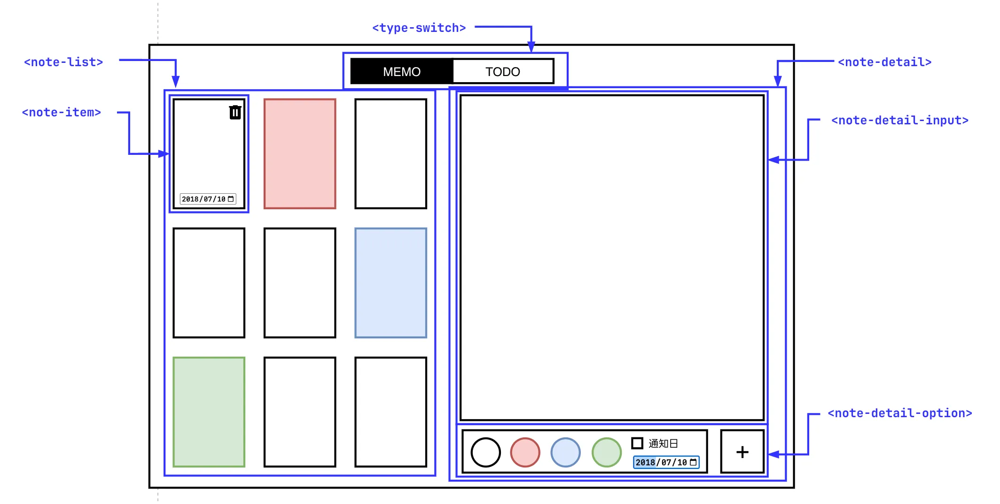

# BangNote

BangNote は、Web カスタム要素を活用したシンプルで機能的なメモ・TODO 管理アプリケーションです。
「MEMO」と「TODO」の 2 つのモードをシームレスに切り替え、日々の思考やタスクを効率的に管理できます。

## アプリ完成イメージ

## 主な機能

### 1. モード切り替え (`<type-switch>`)
* **MEMO モード**: 自由なテキスト入力や画像の挿入が可能なメモ作成モードです。
* **TODO モード**: チェックボックスによるタスク管理と締切日設定が可能なモードです。
* **直感的な操作**: タブをクリックすることでアプリ全体のモード（`$mode` ストア）を瞬時に切り替えます。

### 2. ノート管理 (`<note-list>`, `<note-item>`)
* **自動フィルタリング**: 選択中のモードに合わせて表示するノートを自動で絞り込みます。
* **プレビュー機能**: リスト上でノートの内容、色、通知日/締切日をひと目で確認できます。
* **カラーラベル**: ノートごとに 4 色（白・赤・青・緑）の色分けができ、視覚的な分類が可能です。
* **削除機能**: ゴミ箱アイコンから簡単にノートを削除できます。

### 3. ノート編集 (`<note-detail>`)
* **モード別入力**: テキストエリアでのメモ入力や、改行によるタスク追加など、モードに応じた UI を提供します。
* **詳細オプション**: カラーパレット、日付選択（通知日・締切日）などの操作が可能です。
* **リアルタイム反映**: 入力内容は `$noteDetail` ストアを通じてリアルタイムに反映されます。

## コンポーネント構成

本プロジェクトは以下のカスタム要素で構成されています:
* `<type-switch>`: モード切り替えタブ
* `<note-list>`: ノートの一覧表示エリア
* `<note-item>`: 個別のノートアイテム
* `<note-detail>`: 詳細表示・編集エリアのコンテナ
* `<note-detail-input>`: 本文・タスク入力エリア
* `<note-detail-option>`: 色・日付設定・保存ボタンなどの操作エリア

# see: [spec](./spec), [frontend](./frontend/README.md)
