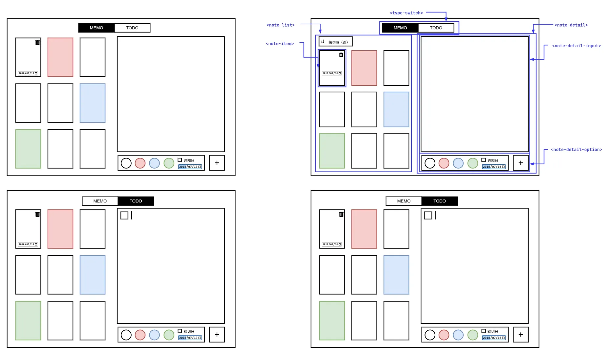
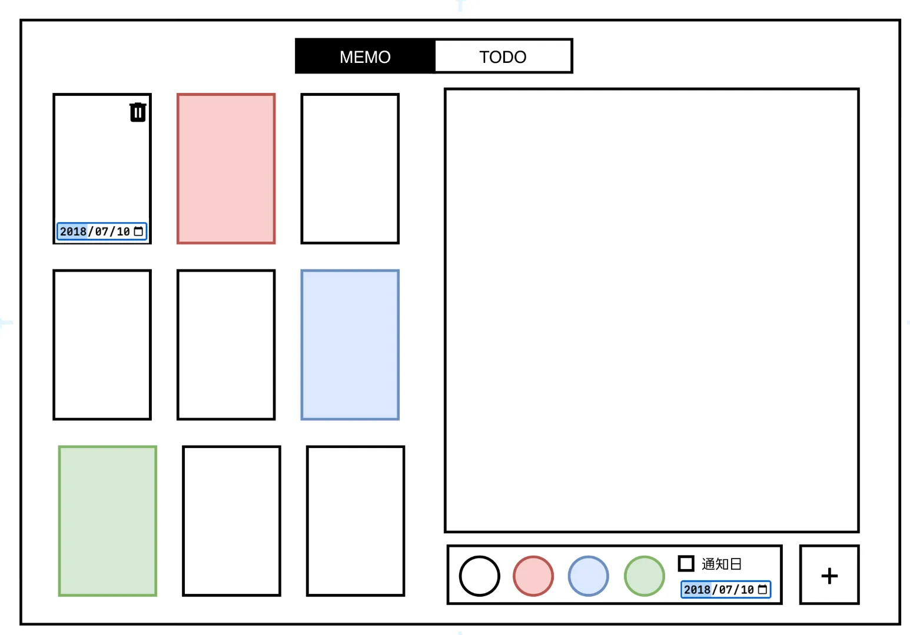
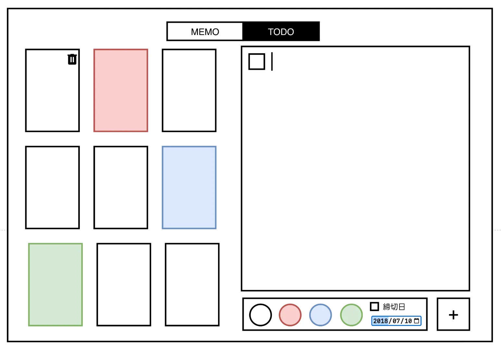

## 仕様

- Web カスタム要素を使ったメモ・TODO 管理アプリケーション「BangNote」
- MEMO モードと TODO モードの 2 つのモードを切り替えられる (`<type-switch>` 要素)
- 左側のノートリスト (`<note-list>` 要素) から個別のノート (`<note-item>`) を選択できる
- 右側の詳細エリア (`<note-detail>` 要素) でノートの内容を表示・編集できる
  - `<note-detail-input>` でテキスト入力
  - `<note-detail-option>` で色の選択 (白・赤・青・緑) やチェック機能、締切日設定が可能
- ノートに画像を挿入できる
- ハッシュタグ機能でノートを分類できる
- TODO モードでは締切日によるソート、チェックボックスでの完了管理が可能
- ノートごとに色分けができ、ノートアイテムに色が反映される
- 削除ボタン (ゴミ箱アイコン) でノートを削除できる
- 保存形式：Markdown、PDF、CSV に対応

## アプリ完成イメージ

## 作業分担

- 画面左側 (`<note-list>`, `<type-switch>` 要素) の担当
  - ノートの一覧機能 — K24064
  - ノートのプレビュー機能 — K24064
  - ノートの種類のトグル機能 — K19117
- 画面右側 (`<note-detail>` 要素) の担当
  - ノートの詳細機能 (表示・入力) — K24009
  - ノートの詳細オプション機能 — K24036
- 全体指揮・コンポーネントのデータの永続化 — K24132

## 作業報告

- ブレスト
  Microsoft Loop を用いて, アイデア出しと機能の洗い出しを実施

> GUI アプリ......
>
> - Java アプリケーション (Java Swing (前期))
> - 画像の変換をやるやつ (PyQt)
> - ロッカー (Django)
> - 場所に対する口コミ (レビューサイト)
>   - 飲食店/スーパー
>   - ホテルの予約
> - Web で動くメモ
>
> - BangNote
> - MEMO と TODO
>   - 画像が間に入れられる
>   - ハッシュタグ機能がある
>   - todo
>     - チェック機能
>     - リマインダー機能 (締切日がある)
> - `!MEMO` で始めるとメモの画面
> - `!TODO` とタスクが書ける画面
> - 保存
>   - Markdown
>   - PDF
>   - csv
> - TODO のメモなら締切日でソートできる
> - 色分け
>
> 
>
> 
>
> 
